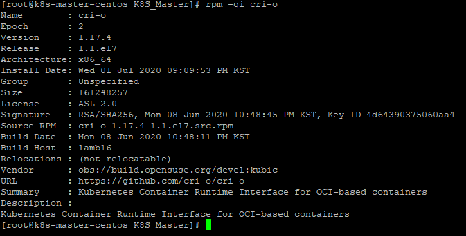
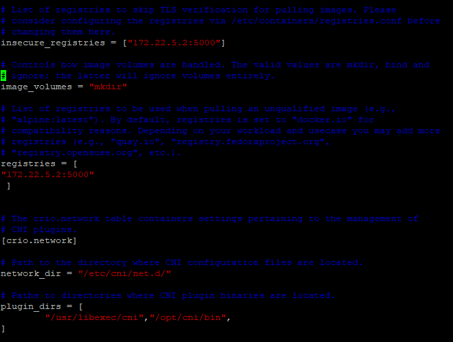

# k8s-node 설치 가이드

## 구성 요소 및 버전
* cri-o (v1.17.4)
* kubeadm, kubelet, kubectl (v1.17.6)

## Prerequisites

## Install Steps
0. [환경 설정](https://github.com/tmax-cloud/hypercloud-install-guide/tree/master/Istio#step0-istio-yaml-%EC%88%98%EC%A0%95)
1. [cri-o 설치](https://github.com/tmax-cloud/hypercloud-install-guide/tree/master/Istio#step-1-istio-namespace-%EB%B0%8F-customresourcedefinition-%EC%83%9D%EC%84%B1)
2. [kubeadm, kubelet, kubectl 설치](https://github.com/tmax-cloud/hypercloud-install-guide/tree/master/Istio#step-2-kiali-%EC%84%A4%EC%B9%98)
3. [kubernetes cluster ](https://github.com/tmax-cloud/hypercloud-install-guide/tree/master/Istio#step-3-istio-tracing-%EC%84%A4%EC%B9%98)


## Step0. 환경 설정
* 목적 : `k8s 설치 진행을 위한 os 환경 설정`
* 순서 : 
    * os hostname을 설정한다.
	```bash
	hostnamectl set-hostname k8s-node
	```
    * hostname과 ip를 등록한다. 
      * vi /etc/hosts
	```bash
	127.0.0.1   localhost localhost.localdomain localhost4 localhost4.localdomain4
	::1         localhost localhost.localdomain localhost6 localhost6.localdomain6

	172.22.5.3 k8s-node
	```
    * 방화벽(firewall)을 해제한다. 
	```bash
	systemctl stop firewalld
	systemctl disable firewalld
	```	
    * 스왑 메모리를 비활성화 한다. 
	```bash
	swapoff -a
	```
    * 스왑 메모리 비활성화 영구설정.
      * vi /etc/fstap
	```bash
	swap 관련 부분 주석처리
	# /dev/mapper/centos-swap swap                    swap    defaults        0
	```
    
    * SELinux 설정을 해제한다. 
	```bash
	setenforce 0
	sed -i 's/^SELINUX=enforcing$/SELINUX=permissive/' /etc/selinux/config
	```

## Step 1. cri-o 설치
* 목적 : `k8s container runtime 설치`
* 순서 :
    * cri-o를 설치한다.
	```bash
	sudo yum -y install cri-o
	systemctl enable crio
	systemctl start crio
	```
    * cri-o 설치를 확인한다.
	```bash
	systemctl status crio
	rpm -qi cri-o
	```
    
* 비고 :
    * 추후 설치예정인 network plugin과 crio의 가상 인터페이스 충돌을 막기위해 cri-o의 default 인터페이스 설정을 제거한다.
	```bash
	rm -rf  /etc/cni/net.d/100-crio-bridge
 	rm -rf  /etc/cni/net.d/200-loopback
	``` 
    * 폐쇄망 환경에서 private registry 접근을 위해 crio.conf 내용을 수정한다.
    * insecure_registry, registries, plugin_dirs 내용을 수정한다.
      * vi /etc/crio/crio.conf
	```bash
	registries = [“172.22.5.2:5000(레지스트리 주소:포트)”,”docker.io”]
	insecure_registries=[“172.22.5.2:5000(레지스트리 주소:포트)”]
	plugin_dirs에 "/opt/cni/bin" 추가
	```
      
    * crio 사용 전 환경 설정
	```bash
	modprobe overlay
	modprobe br_netfilter
	
	cat > /etc/sysctl.d/99-kubernetes-cri.conf <<EOF
	net.bridge.bridge-nf-call-iptables  = 1
	net.ipv4.ip_forward                 = 1
	net.bridge.bridge-nf-call-ip6tables = 1
	EOF
	```	
    * cri-o를 재시작 한다.
	```bash
	systemctl restart crio
	``` 	
## Step 2. kubeadm, kubelet, kubectl 설치
* 목적 : `Kubernetes 구성을 위한 kubeadm, kubelet, kubectl 설치한다.`
* 순서:
    * CRI-O 메이저와 마이너 버전은 쿠버네티스 메이저와 마이너 버전이 일치해야 한다.
    * kubeadm, kubectl, kubelet 설치 (v1.17.6)
	```bash
	yum install -y kubeadm-1.17.6-0 kubelet-1.17.6-0 kubectl-1.17.6-0
	```  	

## Step 3. kubernetes cluster join
* 목적 : `kubernetes cluster에 join한다.`
* 순서 :
    * kubernetes master 구축시 생성된 join token을 worker node에서 실행한다.
    * kubeadm join
	```bash
	kubeadm join 172.22.5.2:6443 --token r5ks9p.q0ifuz5pcphqvc14 \ --discovery-token-ca-cert-hash sha256:90751da5966ad69a49f2454c20a7b97cdca7f125b8980cf25250a6ee6c804d88
	```
    
* 비고 : 
    * kubeadm join command를 저장해놓지 못한 경우, master node에서 아래 명령어를 통해 token 재생성이 가능하다.
	```bash
	kubeadm token create --print-join-command
	```	
