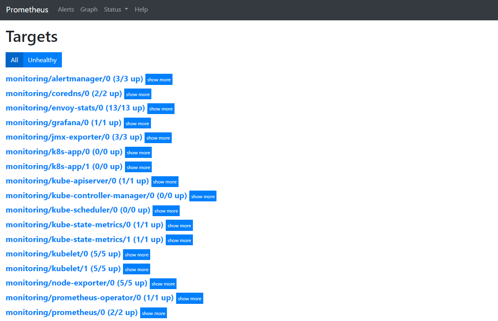
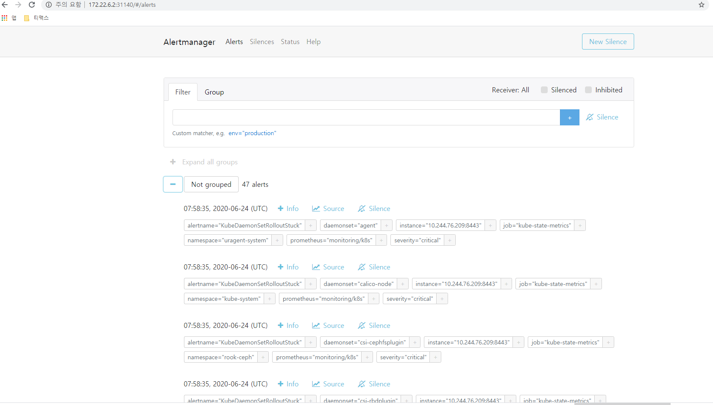

# Prometheus 설치 가이드

## 구성 요소
* prometheus ([quay.io/prometheus/prometheus:v2.11.0](https://quay.io/repository/prometheus/prometheus?tag=latest&tab=tags))
* prometheus-operator ([quay.io/coreos/prometheus-operator:v0.34.0](https://quay.io/repository/coreos/prometheus-operator?tag=latest&tab=tags))
* node-exporter ([quay.io/prometheus/node-exporter:v0.18.1](https://quay.io/repository/prometheus/node-exporter?tag=latest&tab=tags))
* grafana ([grafana/grafana:6.4.3](https://grafana.com/grafana/download))
* kube-state-metric ([quay.io/coreos/kube-state-metrics:v1.8.0](https://quay.io/repository/coreos/kube-state-metrics?tag=latest&tab=tags))
* configmap-reloader ([quay.io/coreos/prometheus-config-reloader:v0.34.0](https://quay.io/repository/coreos/prometheus-config-reloader?tag=latest&tab=tags))
* configmap-reload ([quay.io/coreos/configmap-reload:v0.0.1](https://quay.io/repository/coreos/configmap-reload?tag=latest&tab=tags))
* kube-rbac-proxy ([quay.io/coreos/kube-rbac-proxy:v0.4.1](https://quay.io/repository/coreos/kube-rbac-proxy?tag=latest&tab=tags))
* prometheus-adapter ([quay.io/coreos/k8s-prometheus-adapter-amd64:v0.5.0](https://quay.io/repository/coreos/k8s-prometheus-adapter-amd64?tag=latest&tab=tags))
* alertmanager ([quay.io/prometheus/alertmanager:v0.20.0](https://quay.io/repository/prometheus/alertmanager?tag=latest&tab=tags))


## Prerequisite
설치를 진행하기 전 아래의 과정을 통해 필요한 이미지를 준비한다.
* **폐쇄망에서 설치하는 경우** 사용하는 image repository에 prometheus 설치 시 필요한 이미지를 push해야함
    * 작업 디렉토리 생성 및 환경 설정
    ```
    $ mkdir -p ~/prometheus-install
    $ export PROMETHEUS_HOME=~/prometheus-install
    $ export PROMETHEUS_VERSION=v2.11.0
    $ export PROMETHEUS_OPERATOR_VERSION=v0.34.0
    $ export NODE_EXPORTER_VERSION=v0.18.1
	$ export GRAFANA_VERSION=6.4.3
	$ export KUBE_STATE_METRICS_VERSION=v1.8.0
	$ export CONFIGMAP_RELOADER_VERSION=v0.34.0
	$ export CONFIGMAP_RELOAD_VERSION=v0.0.1
	$ export KUBE_RBAC_PROXY_VERSION=v0.4.1
	$ export PROMETHEUS_ADAPTER_VERSION=v0.5.0
	$ export ALERTMANAGER_VERSION=v0.20.0
	$ export REGISTRY=registryip:port
	$ cd $PROMETHEUS_HOME
    ```
    * 외부 네트워크 통신이 가능한 환경에서 필요한 이미지를 다운받는다.
    ```
    $ sudo docker pull quay.io/prometheus/prometheus:${PROMETHEUS_VERSION}
    $ sudo docker save quay.io/prometheus/prometheus:${PROMETHEUS_VERSION} > prometheus-prometheus_${PROMETHEUS_VERSION}.tar
	$ sudo docker pull quay.io/coreos/prometheus-operator:${PROMETHEUS_OPERATOR_VERSION}
    $ sudo docker save quay.io/coreos/prometheus-operator:${PROMETHEUS_OPERATOR_VERSION} > prometheus-operator_${PROMETHEUS_OPERATOR_VERSION}.tar
	$ sudo docker pull quay.io/prometheus/node-exporter:${NODE_EXPORTER_VERSION}
    $ sudo docker save quay.io/prometheus/node-exporter:${NODE_EXPORTER_VERSION} > node-exporter_${NODE_EXPORTER_VERSION}.tar
	$ sudo docker pull grafana/grafana:${GRAFANA_VERSION}
    $ sudo docker save grafana/grafana:${GRAFANA_VERSION} > grafana_${GRAFANA_VERSION}.tar
	$ sudo docker pull quay.io/coreos/kube-state-metrics:${KUBE_STATE_METRICS_VERSION}
    $ sudo docker save quay.io/coreos/kube-state-metrics:${KUBE_STATE_METRICS_VERSION} > kube-state-metrics_${KUBE_STATE_METRICS_VERSION}.tar
	$ sudo docker pull quay.io/coreos/prometheus-config-reloader:${CONFIGMAP_RELOADER_VERSION}
    $ sudo docker save quay.io/coreos/prometheus-config-reloader:${CONFIGMAP_RELOADER_VERSION} > config-reloader_${CONFIGMAP_RELOADER_VERSION}.tar
	$ sudo docker pull quay.io/coreos/configmap-reload:${CONFIGMAP_RELOAD_VERSION}
    $ sudo docker save quay.io/coreos/configmap-reload:${CONFIGMAP_RELOAD_VERSION} > config-reload_${CONFIGMAP_RELOAD_VERSION}.tar
	$ sudo docker pull quay.io/coreos/kube-rbac-proxy:${KUBE_RBAC_PROXY_VERSION}
    $ sudo docker save quay.io/coreos/kube-rbac-proxy:${KUBE_RBAC_PROXY_VERSION} > kube-rbac-proxy_${KUBE_RBAC_PROXY_VERSION}.tar
	$ sudo docker pull quay.io/coreos/k8s-prometheus-adapter-amd64:${PROMETHEUS_ADAPTER_VERSION}
    $ sudo docker save quay.io/coreos/k8s-prometheus-adapter-amd64:${PROMETHEUS_ADAPTER_VERSION} > prometheus-adapter_${PROMETHEUS_ADAPTER_VERSION}.tar
	$ sudo docker pull quay.io/prometheus/alertmanager:${ALERTMANAGER_VERSION}
    $ sudo docker save quay.io/prometheus/alertmanager:${ALERTMANAGER_VERSION} > alertmanager_${ALERTMANAGER_VERSION}.tar
    ```
    * 생성한 이미지 tar 파일을 폐쇄망 환경으로 이동시킨 뒤 사용하려는 registry에 push한다.
    ```
    $ sudo docker load < prometheus-prometheus_${PROMETHEUS_VERSION}.tar
    $ sudo docker load < prometheus-operator_${PROMETHEUS_OPERATOR_VERSION}.tar
    $ sudo docker load < node-exporter_${NODE_EXPORTER_VERSION}.tar
    $ sudo docker load < grafana_${GRAFANA_VERSION}.tar
	$ sudo docker load < kube-state-metrics_${KUBE_STATE_METRICS_VERSION}.tar
	$ sudo docker load < config-reloader_${CONFIGMAP_RELOADER_VERSION}.tar
	$ sudo docker load < config-reload_${CONFIGMAP_RELOAD_VERSION}.tar
	$ sudo docker load < kube-rbac-proxy_${KUBE_RBAC_PROXY_VERSION}.tar
	$ sudo docker load < prometheus-adapter_${PROMETHEUS_ADAPTER_VERSION}.tar
	$ sudo docker load < alertmanager_${ALERTMANAGER_VERSION}.tar
    
    $ sudo docker tag quay.io/prometheus/prometheus:${PROMETHEUS_VERSION} ${REGISTRY}/prometheus/prometheus:${PROMETHEUS_VERSION}
    $ sudo docker tag quay.io/coreos/prometheus-operator:${PROMETHEUS_OPERATOR_VERSION} ${REGISTRY}/coreos/prometheus-operator:${PROMETHEUS_OPERATOR_VERSION}
    $ sudo docker tag quay.io/prometheus/node-exporter:${NODE_EXPORTER_VERSION} ${REGISTRY}/prometheus/node-exporter:${NODE_EXPORTER_VERSION}
    $ sudo docker tag grafana/grafana:${GRAFANA_VERSION} ${REGISTRY}/grafana:${GRAFANA_VERSION}
	$ sudo docker tag quay.io/coreos/kube-state-metrics:${KUBE_STATE_METRICS_VERSION} ${REGISTRY}/coreos/kube-state-metrics:${KUBE_STATE_METRICS_VERSION}
	$ sudo docker tag quay.io/coreos/prometheus-config-reloader:${CONFIGMAP_RELOADER_VERSION} ${REGISTRY}/coreos/prometheus-config-reloader:${CONFIGMAP_RELOADER_VERSION}
	$ sudo docker tag quay.io/coreos/configmap-reload:${CONFIGMAP_RELOAD_VERSION} ${REGISTRY}/coreos/configmap-reload:${CONFIGMAP_RELOAD_VERSION}
	$ sudo docker tag quay.io/coreos/kube-rbac-proxy:${KUBE_RBAC_PROXY_VERSION} ${REGISTRY}/coreos/kube-rbac-proxy:${KUBE_RBAC_PROXY_VERSION}
	$ sudo docker tag quay.io/coreos/k8s-prometheus-adapter-amd64:${PROMETHEUS_ADAPTER_VERSION} ${REGISTRY}/coreos/k8s-prometheus-adapter-amd64:${PROMETHEUS_ADAPTER_VERSION}
	$ sudo docker tag quay.io/prometheus/alertmanager:${ALERTMANAGER_VERSION} ${REGISTRY}/prometheus/alertmanager:${ALERTMANAGER_VERSION}
    
    $ sudo docker push ${REGISTRY}/prometheus/prometheus:${PROMETHEUS_VERSION}
    $ sudo docker push ${REGISTRY}/coreos/prometheus-operator:${PROMETHEUS_OPERATOR_VERSION}
    $ sudo docker push ${REGISTRY}/prometheus/node-exporter:${NODE_EXPORTER_VERSION}
    $ sudo docker push ${REGISTRY}/grafana:${GRAFANA_VERSION}
	$ sudo docker push ${REGISTRY}/coreos/kube-state-metrics:${KUBE_STATE_METRICS_VERSION}
	$ sudo docker push ${REGISTRY}/coreos/prometheus-config-reloader:${CONFIGMAP_RELOADER_VERSION}
	$ sudo docker push ${REGISTRY}/coreos/configmap-reload:${CONFIGMAP_RELOAD_VERSION}
	$ sudo docker push ${REGISTRY}/coreos/kube-rbac-proxy:${KUBE_RBAC_PROXY_VERSION}
	$ sudo docker push ${REGISTRY}/coreos/k8s-prometheus-adapter-amd64:${PROMETHEUS_ADAPTER_VERSION}
	$ sudo docker push ${REGISTRY}/prometheus/alertmanager:${ALERTMANAGER_VERSION}
	
    ```
	* yaml파일에 version정보를 추가한다.
	* manifests 폴더에 들어가서 아래의 명령어들을 실행한다.
	```
	$ sed -i 's/{ALERTMANAGER_VERSION}/'${ALERTMANAGER_VERSION}'/g' alertmanager-alertmanager.yaml
	$ sed -i 's/{GRAFANA_VERSION}/'${GRAFANA_VERSION}'/g' grafana-deployment.yaml
	$ sed -i 's/{KUBE_RBAC_PROXY_VERSION}/'${KUBE_RBAC_PROXY_VERSION}'/g' kube-state-metrics-deployment.yaml
	$ sed -i 's/{KUBE_STATE_METRICS_VERSION}/'${KUBE_STATE_METRICS_VERSION}'/g' kube-state-metrics-deployment.yaml
	$ sed -i 's/{NODE_EXPORTER_VERSION}/'${NODE_EXPORTER_VERSION}'/g' node-exporter-daemonset.yaml
	$ sed -i 's/{KUBE_RBAC_PROXY_VERSION}/'${KUBE_RBAC_PROXY_VERSION}'/g' node-exporter-daemonset.yaml
	$ sed -i 's/{PROMETHEUS_ADAPTER_VERSION}/'${PROMETHEUS_ADAPTER_VERSION}'/g' prometheus-adapter-deployment.yaml
	$ sed -i 's/{PROMETHEUS_VERSION}/'${PROMETHEUS_VERSION}'/g' prometheus-prometheus.yaml
	```
	* setup 폴더에 들어가서 아래의 명령어들을 실행한다.
	```
	$ sed -i 's/{PROMETHEUS_OPERATOR_VERSION}/'${PROMETHEUS_OPERATOR_VERSION}'/g' prometheus-operator-deployment.yaml
	$ sed -i 's/{CONFIGMAP_RELOADER_VERSION}/'${CONFIGMAP_RELOADER_VERSION}'/g' prometheus-operator-deployment.yaml
	$ sed -i 's/{CONFIGMAP_RELOAD_VERSION}/'${CONFIGMAP_RELOAD_VERSION}'/g' prometheus-operator-deployment.yaml
    ```
	
	* 폐쇄망에서 설치를 진행하여 별도의 image registry를 사용하는 경우 registry 정보를 추가로 설정해준다.
	* (manifests 폴더)
	```
	$ sed -i "s/quay.io\/prometheus\/alertmanager/${REGISTRY}\/prometheus\/alertmanager/g" alertmanager-alertmanager.yaml
	$ sed -i "s/grafana\/grafana/${REGISTRY}\/grafana/g" grafana-deployment.yaml
	$ sed -i "s/quay.io\/coreos\/kube-rbac-proxy/${REGISTRY}\/coreos\/kube-rbac-proxy/g" kube-state-metrics-deployment.yaml
	$ sed -i "s/quay.io\/coreos\/kube-state-metrics/${REGISTRY}\/coreos\/kube-state-metrics/g" kube-state-metrics-deployment.yaml
	$ sed -i "s/quay.io\/prometheus\/node-exporter/${REGISTRY}\/prometheus\/node-exporter/g" node-exporter-daemonset.yaml
	$ sed -i "s/quay.io\/coreos\/kube-rbac-proxy/${REGISTRY}\/coreos\/kube-rbac-proxy/g" node-exporter-daemonset.yaml
	$ sed -i "s/quay.io\/coreos\/k8s-prometheus-adapter-amd64/${REGISTRY}\/coreos\/k8s-prometheus-adapter-amd64/g" prometheus-adapter-deployment.yaml
	$ sed -i "s/quay.io\/prometheus\/prometheus/${REGISTRY}\/prometheus\/prometheus/g" prometheus-prometheus.yaml
	```
	* (setup 폴더)
	```
	$ sed -i "s/quay.io\/coreos\/configmap-reload/${REGISTRY}\/coreos\/configmap-reload/g" prometheus-operator-deployment.yaml
	$ sed -i "s/quay.io\/coreos\/prometheus-config-reloader/${REGISTRY}\/coreos\/prometheus-config-reloader/g" prometheus-operator-deployment.yaml
	$ sed -i "s/quay.io\/coreos\/prometheus-operator/${REGISTRY}\/coreos\/prometheus-operator/g" prometheus-operator-deployment.yaml
	         
	```
	
	

## Install Steps
1. [prometheus namespace 및 crd 생성](https://github.com/tmax-cloud/hypercloud-install-guide/tree/master/Prometheus#step-1-prometheus-namespace-%EB%B0%8F-crd-%EC%83%9D%EC%84%B1)
2. [Prometheus 모듈들에 대한 deploy 및 RBAC 생성 설치](https://github.com/tmax-cloud/hypercloud-install-guide/tree/master/Prometheus#step-2-prometheus-%EB%AA%A8%EB%93%88%EB%93%A4%EC%97%90-%EB%8C%80%ED%95%9C-deploy-%EB%B0%8F-rbac-%EC%83%9D%EC%84%B1)
3. [kube-scheduler 와 kube-controller-manager 설정](https://github.com/tmax-cloud/hypercloud-install-guide/tree/master/Prometheus#step-3-kube-scheduler-%EC%99%80-kube-controller-manager-%EC%84%A4%EC%A0%95)
	


***

## Step 1. prometheus namespace 및 crd 생성
* 목적 : Prometheus Namespace, CRD, Service Account, RBAC 생성
* kubectl create -f setup/ 명령어를 통해 Prometheus CRD 및 Operator 등을 생성 
[setup](https://github.com/tmax-cloud/hypercloud-install-guide/tree/master/Prometheus/yaml/setup)

***

## Step 2. Prometheus 모듈들에 대한 deploy 및 RBAC 생성
* 목적 : Prometheus server, adapter, node exporter, kube-state-metrics, grafana 등을 생성


* kubectl create -f manifests/ 명령어를 통해 Prometheus 모듈 생성([manifests](https://github.com/tmax-cloud/hypercloud-install-guide/tree/master/Prometheus/yaml/manifests))
* 비고
	* Prometheus UI 또는 Grafana 를 사용할 경우 kubectl edit svc $PROMETHEUS_SVC -n monitoring 또는 kubectl edit svc $GRAFANA_SVC -n monitoring 명령어를 통해 ClusterIP 타입으로 생성된 서비스를 LoadBalancer 타입으로 수정한 뒤 해당 IP:port 를 통해 대시보드에 접근할 수 있음

***

## Step 3. kube-scheduler 와 kube-controller-manager 설정

* 목적 : Kubernetes의 scheduler 정보와 controller 정보를 수집하기 위함

* [kube-controller-manager-prometheus-discovery.yaml](https://github.com/tmax-cloud/hypercloud-install-guide/blob/master/Prometheus/yaml/kube-controller-manager-prometheus-discovery.yaml)와 [kube-scheduler-prometheus-discovery.yaml](https://github.com/tmax-cloud/hypercloud-install-guide/blob/master/Prometheus/yaml/kube-scheduler-prometheus-discovery.yaml)를 다운로드 하여
* kubectl create -f kube-controller-manager-prometheus-discovery.yaml 와
* kubectl create -f kube-scheduler-prometheus-discovery.yaml명령어를 실행한다.
* monitoring namespace의 servicemonitor 객체 중 kube-controller-manager 와 kube-scheduler의 spec.endpoints.metricRelabelings 부분 삭제
* kube-system namespace에 있는 모든 kube-schduler pod의 metadata.labels에k8s-app: kube-scheduler추가
* kube-system namespace에 있는 모든 kube-contoroller-manager pod의 metadata.labels에k8s-app: kube-controller-manager 추가


***

## Step 4. 확인
* 목적: prometheus와 alertmanager가 정상적으로 동작하는지 확인하기 위함
* kubectl get svc -n monitoring 을 실행 후 prometheus와 alertmanager의 ui 주소를 확인하고 접속한다.
* prometheus에서는 Target 탭에 다음과 같이 설정 한 타겟들이 보이면 정상이다.



* alertmanager에서는 Alerts 탭에서 다음과 같이 alert들이 보이면 정상이다.

