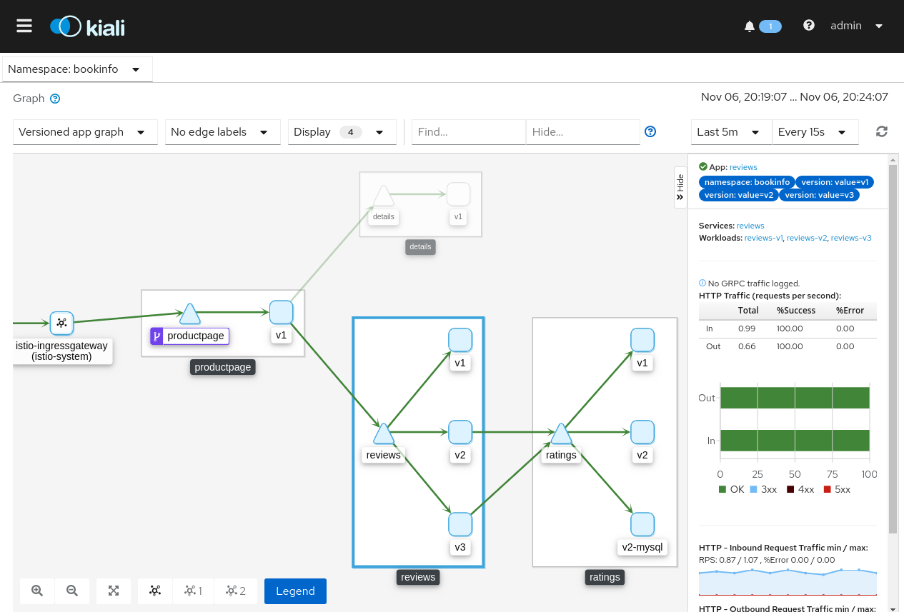

# Istio 설치 가이드

## 구성 요소 및 버전
* istiod ([docker.io/istio/pilot:1.5.1](https://hub.docker.com/layers/istio/pilot/1.5.1/images/sha256-818aecc1c73c53af9091ac1d4f500d9d7cec6d135d372d03cffab1addaff4ec0?context=explore))
* istio-ingressgateway ([docker.io/istio/proxyv2:1.5.1](https://hub.docker.com/layers/istio/proxyv2/1.5.1/images/sha256-3ad9ee2b43b299e5e6d97aaea5ed47dbf3da9293733607d9b52f358313e852ae?context=explore))
* istio-tracing ([docker.io/jaegertracing/all-in-one:1.16](https://hub.docker.com/layers/jaegertracing/all-in-one/1.16/images/sha256-738442983b772a5d413c8a2c44a5563956adaff224e5b38f52a959124dafc119?context=explore))
* kiali ([quay.io/kiali/kiali:v1.19](https://quay.io/repository/kiali/kiali?tab=tags))

## Prerequisites

## 폐쇄망 설치 가이드
설치를 진행하기 전 아래의 과정을 통해 필요한 이미지 및 yaml 파일을 준비한다.
1. **폐쇄망에서 설치하는 경우** 사용하는 image repository에 istio 설치 시 필요한 이미지를 push한다. 

    * 작업 디렉토리 생성 및 환경 설정
    ```bash
    $ mkdir -p ~/istio-install
    $ export ISTIO_HOME=~/istio-install
    $ export ISTIO_VERSION=1.5.1
    $ export JAEGER_VERSION=1.16
    $ export KIALI_VERSION=v1.19
    $ cd $ISTIO_HOME
    ```
    * 외부 네트워크 통신이 가능한 환경에서 필요한 이미지를 다운받는다.
    ```bash
    $ sudo docker pull istio/pilot:${ISTIO_VERSION}
    $ sudo docker save istio/pilot:${ISTIO_VERSION} > istio-pilot_${ISTIO_VERSION}.tar
    $ sudo docker pull istio/proxyv2:${ISTIO_VERSION}
    $ sudo docker save istio/proxyv2:${ISTIO_VERSION} > istio-proxyv2_${ISTIO_VERSION}.tar
    $ sudo docker pull jaegertracing/all-in-one:${JAEGER_VERSION}
    $ sudo docker save jaegertracing/all-in-one:${JAEGER_VERSION} > jaeger_${JAEGER_VERSION}.tar
    $ sudo docker pull quay.io/kiali/kiali:${KIALI_VERSION}
    $ sudo docker save quay.io/kiali/kiali:${KIALI_VERSION} > kiali_${KIALI_VERSION}.tar
    ```
    * install yaml을 다운로드한다.
    ```bash
    $ wget -O hypercloud-install.tar.gz https://github.com/tmax-cloud/hypercloud-install-guide/archive/v${INSTALL_GUIDE_VERSION}.tar.gz
    ```
  
2. 위의 과정에서 생성한 tar 파일들을 폐쇄망 환경으로 이동시킨 뒤 사용하려는 registry에 이미지를 push한다.
    ```bash
    $ sudo docker load < istio-pilot_${ISTIO_VERSION}.tar
    $ sudo docker load < istio-proxyv2_${ISTIO_VERSION}.tar
    $ sudo docker load < jaeger_${JAEGER_VERSION}.tar
    $ sudo docker load < kiali_${KIALI_VERSION}.tar
    
    $ sudo docker tag istio/pilot:${ISTIO_VERSION} ${REGISTRY}/istio/pilot:${ISTIO_VERSION}
    $ sudo docker tag istio/proxyv2:${ISTIO_VERSION} ${REGISTRY}/istio/proxyv2:${ISTIO_VERSION}
    $ sudo docker tag jaegertracing/all-in-one:${JAEGER_VERSION} ${REGISTRY}/jaegertracing/all-in-one:${JAEGER_VERSION}
    $ sudo docker tag quay.io/kiali/kiali:${KIALI_VERSION} ${REGISTRY}/quay.io/kiali/kiali:${KIALI_VERSION}
    
    $ sudo docker push ${REGISTRY}/istio/pilot:${ISTIO_VERSION}
    $ sudo docker push ${REGISTRY}/istio/proxyv2:${ISTIO_VERSION}
    $ sudo docker push ${REGISTRY}/jaegertracing/all-in-one:${JAEGER_VERSION}
    $ sudo docker push ${REGISTRY}/quay.io/kiali/kiali:${KIALI_VERSION}
    ```


## Install Steps
0. [istio yaml 수정](http://192.168.1.150:10080/hypercloud/hypercloud/wikis/Istio-InstallerGuide#step-1-istio-namespace-%EB%B0%8F-customresourcedefinition-%EC%83%9D%EC%84%B1)
1. [istio namespace 및 customresourcedefinition 생성](http://192.168.1.150:10080/hypercloud/hypercloud/wikis/Istio-InstallerGuide#step-1-istio-namespace-%EB%B0%8F-customresourcedefinition-%EC%83%9D%EC%84%B1)
2. [kiali 설치](http://192.168.1.150:10080/hypercloud/hypercloud/wikis/Istio-InstallerGuide#step-2-kiali-%EC%84%A4%EC%B9%98)
3. [istio-tracing 설치](http://192.168.1.150:10080/hypercloud/hypercloud/wikis/Istio-InstallerGuide#step-3-istio-tracing-%EC%84%A4%EC%B9%98)
4. [istiod 설치](http://192.168.1.150:10080/hypercloud/hypercloud/wikis/Istio-InstallerGuide#step-4-istiod-%EC%84%A4%EC%B9%98)
5. [istio-ingressgateway 설치](http://192.168.1.150:10080/hypercloud/hypercloud/wikis/Istio-InstallerGuide#step-5-istio-ingressgateway-%EC%84%A4%EC%B9%98)
6. [istio metric prometheus에 등록](http://192.168.1.150:10080/hypercloud/hypercloud/wikis/Istio-InstallerGuide#step-6-istio-metric-prometheus%EC%97%90-%EB%93%B1%EB%A1%9D)
7. [bookinfo 예제](http://192.168.1.150:10080/hypercloud/hypercloud/wikis/Istio-InstallerGuide#step-7-bookinfo-%EC%98%88%EC%A0%9C)


## Step0. istio yaml 수정
* 목적 : `istio yaml에 이미지 registry, 버전 정보를 수정`
* 생성 순서 : 
    * 아래의 command를 수정하여 사용하고자 하는 image 버전 정보를 수정한다.
	```bash
	$ sed -i 's/{kiali_version}/'${KIALI_VERSION}'/g' 2.kiali.yaml
	$ sed -i 's/{jaeger_version}/'${JAEGER_VERSION}'/g' 3.istio-tracing.yaml
	$ sed -i 's/{istio_version}/'${ISTIO_VERSION}'/g' 4.istio-core.yaml
	$ sed -i 's/{istio_version}/'${ISTIO_VERSION}'/g' 5.istio-ingressgateway.yaml
	```
* 비고 :
    * `폐쇄망에서 설치를 진행하여 별도의 image registry를 사용하는 경우 registry 정보를 추가로 설정해준다.`
	```bash
	$ sed -i 's/quay.io\/kiali\/kiali/'${REGISTRY}'\/kiali\/kiali/g' 2.kiali.yaml
	$ sed -i 's/docker.io\/jaegertracing\/all-in-one/'${REGISTRY}'\/jaegertracing\/all-in-one/g' 3.istio-tracing.yaml
	$ sed -i 's/docker.io\/istio\/pilot/'${REGISTRY}'\/istio\/pilot/g' 4.istio-core.yaml
	$ sed -i 's/docker.io\/istio\/proxyv2/'${REGISTRY}'\/istio\/proxyv2/g' 5.istio-ingressgateway.yaml
	```

## Step 1. istio namespace 및 customresourcedefinition 생성
* 목적 : `istio system namespace, clusterrole, clusterrolebinding, serviceaccount, customresourcedefinition 생성`
* 생성 순서 : [1.istio-base.yaml](yaml/1.istio-base.yaml) 실행 `ex) kubectl apply -f 1.istio-base.yaml`


## Step 2. kiali 설치
* 목적 : `istio ui kiali 설치`
* 생성 순서: [2.kiali.yaml](yaml/2.kiali.yaml) 실행
* 비고 :
    * kiali에 접속하기 위한 서비스를 [원하는 타입](yaml/2.kiali.yaml#L346)으로 변경할 수 있다.
    * kiali에 접속하기 위한 [id/password](yaml/2.kiali.yaml#L215)를 configmap을 수정해 변경할 수 있다.(default: admin/admin)
    * kilai pod가 running임을 확인한 뒤 http://$KIALI_URL/kiali 에 접속해 정상 동작을 확인한다.
	


## Step 3. istio-tracing 설치
* 목적 : `tracing component jaeger 설치`
* 생성 순서 : [3.istio-tracing.yaml](yaml/3.istio-tracing.yaml) 실행
* 비고 : 
    * jaeger ui에 접속하기 위한 서비스를 [원하는 타입](yaml/3.istio-tracing.yaml#L245)으로 변경할 수 있다.
    * istio-tracing pod가 running임을 확인한 뒤 http://$JAEGER_URL/jaeger/search 에 접속해 정상 동작을 확인한다.
	


## Step 4. istiod 설치
* 목적 : `istio core component 설치(istiod deployment, sidecar configmap, mutatingwebhookconfiguration...)`
* 생성 순서 : [4.istio-core.yaml](yaml/4.istio-core.yaml) 실행
* 비고 : 
    * [istio라는 이름의 configmap](yaml/4.istio-core.yaml#L403)을 수정하여 설정을 변경할 수 있다. 관련 설정은 [istio mesh config](https://istio.io/docs/reference/config/istio.mesh.v1alpha1/#MeshConfig)를 참고한다.
        * access log format을 변경하고 싶은 경우 [mesh.accessLogFormat](yaml/4.istio-core.yaml#L468)을 원하는 format으로 변경한다.
        * tracing sampling rate을 변경하고 싶은 경우 [value.traceSampling](yaml/4.istio-core.yaml#L459)을 원하는 값으로 변경한다.


## Step 5. istio-ingressgateway 설치
* 목적 : `istio ingressgateway 설치`
* 생성 순서 : [5.istio-ingressgateway.yaml](yaml/5.istio-ingressgateway.yaml) 실행


## Step 6. istio metric prometheus에 등록
* 목적 : `istio metric을 수집하기 위한 podmonitor 생성`
* 생성 순서 : [6.istio-metric.yaml](yaml/6.istio-metric.yaml) 실행
* 비고 : 
    * http://$PROMETHEUS_URL/graph 에 접속해 'envoy_'로 시작하는 istio 관련 metric이 수집되었는지 확인한다.
    * 만약 istio 관련 metric이 수집되지 않을 경우, Prometheus의 권한설정 문제일 수 있다. [prometheus-clusterRole.yaml](http://192.168.1.150:9090/share/page/site/cloud-rnd-site/document-details?nodeRef=workspace://SpacesStore/7c979728-6d13-4396-a0d2-2aeb2e594194#)을 적용하거나 Prometheus를 최신 버전으로 설치한다.


## Step 7. bookinfo 예제
* 목적 : `istio 설치 검증을 위한 bookinfo 예제`
* 생성 순서 : [bookinfo.yaml](yaml/bookinfo.yaml) 실행
* 비고 : 
    * bookinfo 예제 배포
        * application에 접속하기 위해 [service productpage의 타입](yaml/bookinfo.yaml#L278)을 NodePort/LoadBalancer로 변경한다.
        * bookinfo 예제를 배포할 namespace에 istio-injected=enabled label을 추가한 뒤, bookinfo 예제를 배포한다. 
        ```bash
        $ kubectl label namespace $YOUR_NAMESPACE istio-injection=enabled
        $ kubectl apply -f bookinfo.yaml -n $YOUR_NAMESPACE
        ```
    * http://$PRODUCTPAGE_URL/productpage 에 접속해 정상적으로 배포되었는지 확인한 뒤, kiali dashboard(http://$KIALI_URL/kiali)에 접속해 아래 그림과 같이 서비스간에 관계를 표현해주는 그래프가 나오는지 확인한다.
	
